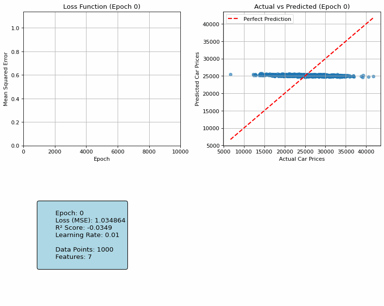

# Linear Regression from Scratch

A complete implementation of Linear Regression using gradient descent, built from scratch with NumPy. This project demonstrates the mathematical concepts behind linear regression and visualizes the learning process through animated plots.

## 🎯 Project Overview

This project implements linear regression without using any machine learning libraries (like scikit-learn's LinearRegression). It includes:

- **Custom LinearRegression class** with gradient descent optimization
- **Data preprocessing** (encoding categorical variables, feature scaling)
- **Animated visualization** showing how predictions improve over training epochs
- **Performance metrics** (Loss function, R² score)

## 📊 Dataset

The project uses a **Car Price Prediction dataset** with features like:
- Car model, brand, year
- Engine specifications
- Mileage, condition
- Target: Car price

## 🛠️ Implementation Details

### Linear Regression Class
```python
class LinearRegression:
    def __init__(self, lr=0.001, epochs=100):
        self.lr = lr  # Learning rate
        self.epochs = epochs  # Number of training iterations
        self.loss_history = []  # Track loss over time
        
    def fit(self, X_train, Y_train, save_epochs=None):
        # Initialize weights randomly
        # Add bias term (column of ones)
        # Gradient descent optimization
        
    def predict(self, X):
        # Make predictions on new data
```

### Key Features

1. **Gradient Descent**: Uses matrix operations for efficient computation
2. **Bias Term**: Automatically adds bias (intercept) to the model
3. **Data Scaling**: StandardScaler for feature normalization
4. **Animation**: Saves predictions at specific epochs for visualization

## 🎬 Training Visualization

The project creates an animated GIF showing:



- **Loss Function**: How the cost decreases over epochs
- **Actual vs Predicted**: Scatter plot showing prediction accuracy
- **Statistics**: Real-time metrics (MSE, R² score, learning rate)

## 🚀 How to Run

1. **Install dependencies**:
```bash
pip install numpy pandas matplotlib pillow scikit-learn
```

2. **Prepare your dataset**:
   - Place `Car_Price_Prediction.csv` in the project directory
   - Or modify the code to use your own dataset

3. **Run the notebook**:
   - Execute all cells in `LinearRegressionScratch.ipynb`
   - The animated GIF will be automatically generated

## 📈 Results

### Final Performance Metrics
- **Loss (MSE)**: Shows the mean squared error after training
- **R² Score**: Coefficient of determination (closer to 1 = better fit)
- **Training Epochs**: Total iterations completed

### Example Output
```
EPOCH:0 , LOSS:0.8234
EPOCH:1000 , LOSS:0.3456
EPOCH:2000 , LOSS:0.1789
...
Final Loss (MSE): 0.0234
Final R² Score: 0.8967
Training completed in 10000 epochs
```

## 🧮 Mathematical Foundation

### Linear Regression Equation
```
y = w₀ + w₁x₁ + w₂x₂ + ... + wₙxₙ
```
Where:
- `y` = predicted value
- `w₀` = bias (intercept)
- `wᵢ` = weights for features
- `xᵢ` = feature values

### Cost Function (Mean Squared Error)
```
MSE = (1/m) * Σ(yᵢ - ŷᵢ)²
```

### Gradient Descent Update Rule
```
w = w - α * (∂MSE/∂w)
```
Where `α` is the learning rate.

## 🔧 Customization

### Hyperparameters
- **Learning Rate**: `lr=0.01` (adjust for convergence speed)
- **Epochs**: `epochs=10000` (number of training iterations)
- **Animation Frames**: Modify `save_epochs` list for different visualization points

### Data Preprocessing
- **Label Encoding**: Converts categorical variables to numerical
- **Standard Scaling**: Normalizes features to have mean=0, std=1
- **Train/Test Split**: Can be added for model evaluation

## 📁 Project Structure

```
LinearRegression-from-scratch/
│
├── LinearRegressionScratch.ipynb    # Main notebook
├── Car_Price_Prediction.csv         # Dataset
├── linear_regression_training.gif   # Generated animation
├── README.md                        # This file
└── temp_plots/                      # Temporary images (auto-deleted)
```

## 🎓 Learning Outcomes

This project demonstrates:
- **Matrix operations** for efficient computation
- **Gradient descent** optimization algorithm
- **Data preprocessing** techniques
- **Visualization** of machine learning training process
- **Performance evaluation** metrics

## 🤝 Contributing

Feel free to:
- Add new features (regularization, different optimizers)
- Improve visualizations
- Add more datasets
- Optimize performance

## 📚 References

- [Linear Regression Theory](https://en.wikipedia.org/wiki/Linear_regression)
- [Gradient Descent Algorithm](https://en.wikipedia.org/wiki/Gradient_descent)
- [NumPy Documentation](https://numpy.org/doc/)

---

**Note**: This implementation is for educational purposes. For production use, consider using optimized libraries like scikit-learn.
